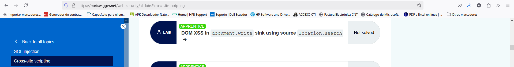
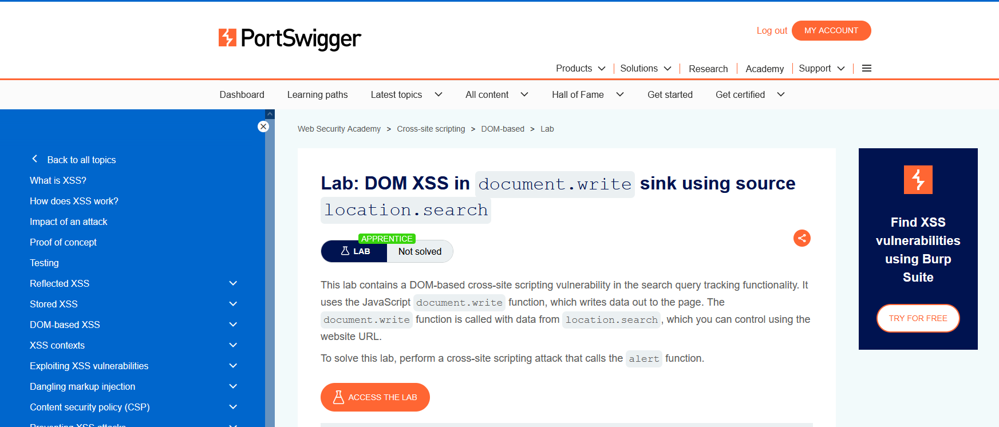
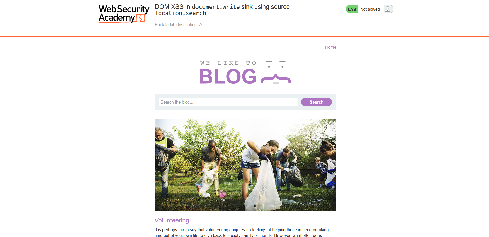
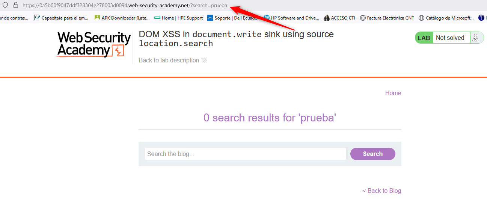
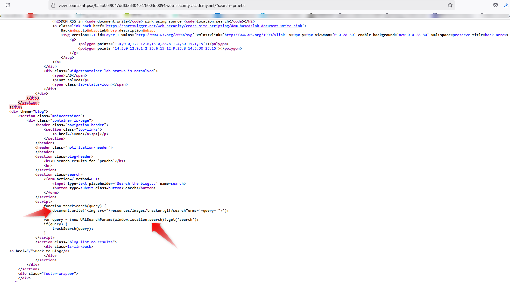
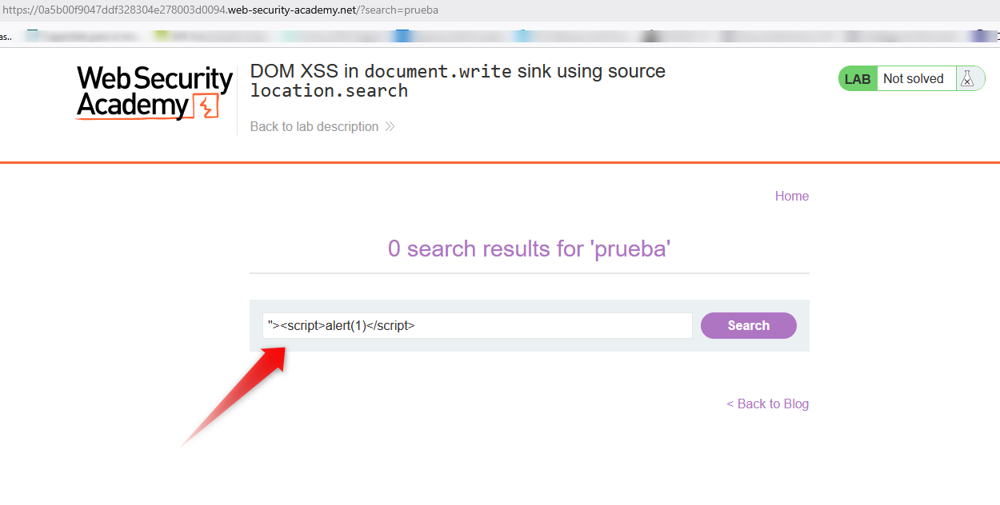
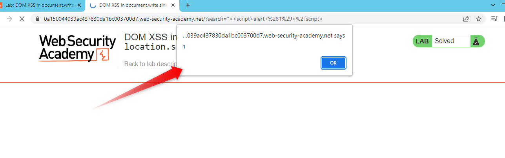
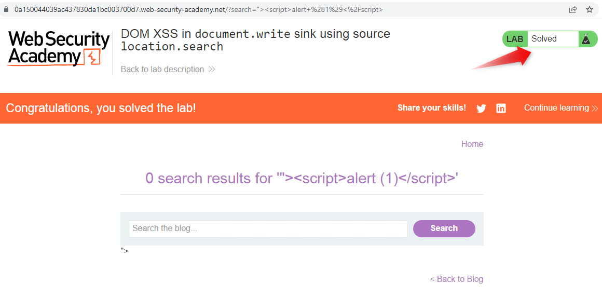
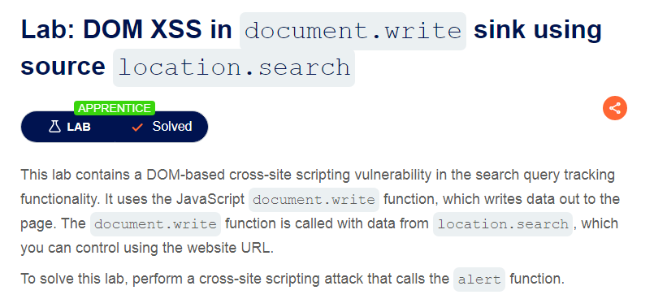

## **RESOLUCIÓN EJERCICIO CROSS-SITE SCRIPTING DE LA PLATAFORMA PORTSWIGGER**

### 1. Seleccionamos el LAB **DOM XSS in document.write sink using source location.search**

### 2. A continuación, encontramos la descripción del LAB.

### 3. Ingresamos el laboratorio y vemos lo siguiente, tiene una barra de buscador:

### 4. Vemos que en la barra del navegador 

### 5. Ahora vemos el código fuente de la página (ctrl+u) para buscar y ubicar (location.search) y (windows.write) en base a lo que nos mencionaba la descripción del laboratorio.

### 6. Una vez determinado cómo funciona la barra de búsqueda podemos observar que se podría incluir código JavaScript por ahí para modificar la etiqueta HTML (img).

### 7. Este es el resultado y nos aparece el pop-up con lo puesto

### 8. Con esto el laboratorio queda solucionado.

